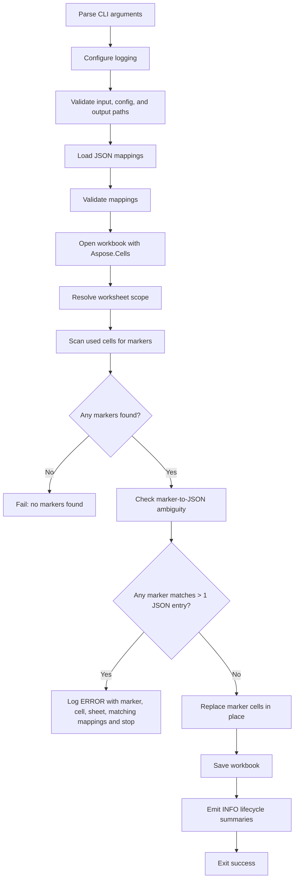

# Excel Marker Filler Design Document

## Purpose

This document describes the marker-based Excel filler built with **Aspose.Cells for Java**. The program scans one or more worksheets for markers bounded by `[{!` and `!}]`, matches the marker contents against JSON `key` and `aliases`, replaces matching marker cells in place, and stops with a detailed error if a single marker matches more than one JSON entry.

Related project documents:
- [README](../README.md)
- [Implementation Notes](implementation-notes.md)
- [Javadoc Notes](javadoc-notes.md)
- [JSON Schema and Matching](json-schema-and-matching.md)
- [Runbook](runbook.md)
- [Versioning Notes](versioning-notes.md)

---

## High-Level Behavior

1. Parse command-line arguments.
2. Configure logging.
3. Validate the input workbook path, JSON config path, and output location.
4. Load JSON mappings.
5. Validate mappings.
6. Open the Excel workbook with Aspose.Cells.
7. Resolve which worksheets to scan.
8. Scan cells for markers matching `[{!...!}]`.
9. Detect ambiguous matches between markers and JSON entries.
10. Replace marker cells in place.
11. Save the workbook.
12. Emit lifecycle summary logs.

---

## Core Aspose.Cells Types Used

### `com.aspose.cells.Workbook`
Used as the root object for loading and saving Excel files.

Methods used:
- `new Workbook(String fileName)`
  - Opens the source workbook from disk.
- `getWorksheets()`
  - Returns the workbook’s worksheet collection.
- `save(String fileName)`
  - Writes the updated workbook to disk.

Why it is used:
- It is the entry point for reading and writing Excel documents in Aspose.Cells.

---

### `com.aspose.cells.Worksheet`
Represents a single sheet in the workbook.

Methods used:
- `getName()`
  - Used for logging and error reporting.
- `getCells()`
  - Returns the `Cells` collection for scanning and updates.

Why it is used:
- The program scans sheet-by-sheet and logs sheet names in every important event.

---

### `com.aspose.cells.Cells`
Represents the cell grid within a worksheet.

Methods used:
- `getMaxDataRow()`
  - Identifies the last row that contains data.
- `getMaxDataColumn()`
  - Identifies the last column that contains data.
- `get(int row, int column)`
  - Retrieves a `Cell` for inspection or replacement.

Why it is used:
- The program performs a bounded scan over the used data region instead of iterating the full Excel grid.

Design implication:
- This is simple and predictable, though not the most optimized approach for sparse sheets.

---

### `com.aspose.cells.Cell`
Represents an individual Excel cell.

Methods used:
- `getValue()`
  - Reads the cell contents so the program can identify string markers.
- `getName()`
  - Produces Excel addresses like `G4` for logging and error messages.
- `putValue(Object value)`
  - Replaces the marker text with the final mapped value.

Why it is used:
- Marker detection and replacement both happen at the individual cell level.

Important behavior:
- The program only replaces cells that still contain valid marker syntax.
- Replacement is **in place**. No adjacent-cell logic is used in this design.

---

## Aspose Method Usage by Program Stage

### 1. Workbook load
```java
Workbook workbook = new Workbook(inputPath.toString());
```
Uses:
- `Workbook(String fileName)`

Purpose:
- Opens the Excel workbook supplied on the command line.

Failure modes:
- Bad path
- Unsupported/corrupt workbook
- File access issues

---

### 2. Worksheet resolution
```java
workbook.getWorksheets().getCount();
workbook.getWorksheets().get(i);
```
Uses:
- `Workbook.getWorksheets()`
- worksheet collection `getCount()`
- worksheet collection `get(int index)`

Purpose:
- Supports either first-sheet-only mode or `--scan-all-sheets` mode.

---

### 3. Cell scanning
```java
Cells cells = worksheet.getCells();
int maxDataRow = cells.getMaxDataRow();
int maxDataColumn = cells.getMaxDataColumn();
Cell cell = cells.get(row, col);
Object value = cell.getValue();
```
Uses:
- `Worksheet.getCells()`
- `Cells.getMaxDataRow()`
- `Cells.getMaxDataColumn()`
- `Cells.get(int, int)`
- `Cell.getValue()`

Purpose:
- Restricts scanning to the used range and tests each string-valued cell against the marker regex.

---

### 4. Marker identification and logging
```java
String cellName = cell.getName();
```
Uses:
- `Cell.getName()`

Purpose:
- Produces user-friendly addresses like `G4` for logs, troubleshooting, and ambiguity errors.

---

### 5. In-place replacement
```java
markerCell.cell.putValue(mapping.getValue());
```
Uses:
- `Cell.putValue(Object)`

Purpose:
- Replaces the full marker text, such as `[{!Borrower Principal Name!}]`, with the mapped JSON value.

Design implication:
- The marker cell becomes a normal value cell after replacement.
- A second run against the already-filled workbook will not treat that cell as a marker anymore.

---

### 6. Save output
```java
workbook.save(outputPath.toString());
```
Uses:
- `Workbook.save(String fileName)`

Purpose:
- Persists all in-memory replacements into the output workbook.

---

## Why These Aspose APIs Were Chosen

This project intentionally uses a **small, stable subset** of Aspose.Cells:
- workbook load/save
- worksheet enumeration
- used-range discovery
- direct cell read/write

That keeps the design easy to reason about and avoids overfitting to layout assumptions.

The earlier adjacent-cell approach depended on positional inference. This marker-based design avoids that by making the destination explicit inside the workbook itself.

---

## Matching Rules

A marker like:
```text
[{!Borrower Principal Name!}]
```
produces the logical marker name:
```text
Borrower Principal Name
```

That marker name is tested against each JSON entry:
- `key`
- each item in `aliases`

Rules:
- Match is **OR-based**.
- `CaseSensitivity` is optional and defaults to `false`.
- `ReplaceAll` is optional and defaults to `true`.
- If one marker matches more than one JSON entry, the program throws an error and stops.

See also: [JSON Schema and Matching](json-schema-and-matching.md)

---

## Ambiguity Detection Design

Ambiguity is checked **before any cell is modified**.

Example failure case:
- Marker: `Borrower Principal Name`
- JSON entry 1 aliases include `Borrower Principal Name`
- JSON entry 2 key is `Borrower Principal Name`

In that case, the program emits one aggregated error containing:
- marker name
- sheet name
- cell address
- all matching JSON entries

This is designed for log aggregators such as Datadog, where one dense error event is easier to search and alert on.

---

## Logging Specification

The logging model is intentionally compact at `INFO`, detailed at `DEBUG`, and fail-fast at `ERROR`.

### Log levels

- `INFO`
  - lifecycle summary events only
  - low-volume and suitable for normal production operation
- `DEBUG`
  - per-sheet, per-marker, and per-mapping diagnostic detail
  - intended for troubleshooting and local testing
- `ERROR`
  - one ambiguity event per failing marker, followed by process termination

### Required field names

Use these field names consistently across log lines:
- `event`
- `status`
- `input`
- `config`
- `output`
- `scanAllSheets`
- `elapsedMs`
- `mappingsLoaded`
- `mappingsEvaluated`
- `mappingsMatched`
- `mappingsUnmatched`
- `replaceAllFalseMappings`
- `markersDiscovered`
- `markersMatched`
- `cellsReplaced`
- `sheetsConsidered`
- `sheetsScanned`
- `sheet`
- `cell`
- `markerRaw`
- `markerName`
- `mappingIndex`
- `key`
- `aliases`
- `caseSensitive`
- `replaceAll`
- `matchedMarkers`
- `matchedCells`
- `errorType`
- `message`

### INFO events

The application should emit exactly these lifecycle summaries at `INFO` level:

#### 1. Run start
```text
event=run_start input="<absolute input path>" config="<absolute config path>" output="<absolute output path>" scanAllSheets=<true|false>
```

#### 2. Mappings loaded
```text
event=mappings_loaded mappingsLoaded=<count> config="<absolute config path>"
```

#### 3. Marker discovery complete
```text
event=marker_discovery_complete sheetsConsidered=<count> sheetsScanned=<count> markersDiscovered=<count>
```

#### 4. Validation complete
```text
event=validation_complete ambiguousMarkers=0 ambiguousMappings=0 validationStatus=passed
```

#### 5. Replacement complete
```text
event=replacement_complete mappingsEvaluated=<count> mappingsMatched=<count> mappingsUnmatched=<count> replaceAllFalseMappings=<count> markersMatched=<count> cellsReplaced=<count>
```

#### 6. Workbook saved
```text
event=workbook_saved output="<absolute output path>"
```

#### 7. Run complete
```text
event=run_complete status=success elapsedMs=<milliseconds> sheetsScanned=<count> markersDiscovered=<count> mappingsLoaded=<count> mappingsMatched=<count> mappingsUnmatched=<count> cellsReplaced=<count>
```

### DEBUG events

These lines are designed for troubleshooting. They should not be promoted to `INFO`.

#### Worksheet scan start
```text
event=worksheet_scan_start sheet="<sheet name>" maxDataRow=<row> maxDataColumn=<column>
```

#### Marker discovered
```text
event=marker_discovered sheet="<sheet name>" cell="<cell address>" markerRaw="[{!...!}]" markerName="<marker contents>"
```

#### Mapping evaluation start
```text
event=mapping_evaluation_start mappingIndex=<index> key="<key>" aliases=<aliases> replaceAll=<true|false> caseSensitive=<true|false>
```

#### Mapping result
```text
event=mapping_result mappingIndex=<index> key="<key>" matchedMarkers=<count> replacedCells=<count> matchedCells=<sheet-and-cell list>
```

#### Cell replaced
```text
event=cell_replaced mappingIndex=<index> key="<key>" sheet="<sheet name>" cell="<cell address>" markerName="<marker contents>" value="<resolved value>"
```

### ERROR event for ambiguity

When a single marker matches more than one JSON entry, the application must emit one dense `ERROR` line and then stop:

```text
event=validation_failed errorType=ambiguous_marker_match status=failed sheet="<sheet name>" cell="<cell address>" markerRaw="[{!...!}]" markerName="<marker contents>" matchingMappings=[{mappingIndex=<index>,key="<key>",aliases=<aliases>}, ...] message="Marker matched more than one JSON entry"
```

This format is optimized for log aggregators because it keeps all evidence for one ambiguity in a single searchable event.

---

## Flowchart



---

## Operational Notes

- This design does **not** guess where values should go.
- The Excel template itself declares destinations through marker cells.
- The program only modifies cells that contain valid markers.
- JSON entries with no matching markers are treated as normal and are visible in `DEBUG`, not `INFO`.

See also:
- [Implementation Notes](implementation-notes.md)
- [Runbook](runbook.md)
- [JSON Schema and Matching](json-schema-and-matching.md)
