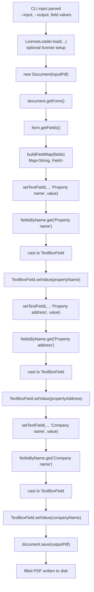

# PDF Form CLI (Aspose) - Fill JLL AcroForm Fields

A production-ready Java CLI that uses **Aspose.PDF for Java** to populate selected AcroForm fields in the JLL Site Inspection Questionnaire.

This project fills three text fields by exact AcroForm name:

- `Property name`
- `Property address`
- `Company name`

For the full design rationale, see [docs/aspose-acroform-cli-design.md](./docs/aspose-acroform-cli-design.md).

## Features

- Fills selected AcroForm text fields using exact field-name matching
- Writes to a separate output file and never modifies the source PDF in place
- Offers a diagnostic `--list-fields` mode for template inspection
- Supports Aspose license loading from a CLI flag or environment variable
- Returns stable exit codes for automation and CI usage

## Requirements

- Java 11+
- Maven 3.8+
- Access to the Aspose repository for dependency resolution

Aspose publishes the `com.aspose:aspose-pdf:26.3` Maven dependency and hosts it in the Aspose repository.

## Build

```bash
mvn clean package
```

This produces an executable shaded jar at:

```text
target/pdf-form-cli.jar
```

## Usage

```bash
java -jar target/pdf-form-cli.jar \
  --input "JLL Site Inspection Questionnaire 2026.pdf" \
  --output "filled.pdf" \
  --property-name "Sunset Villas" \
  --property-address "123 Main Street" \
  --company-name "Acme Management LLC"
```

## Form Fill Flow

The CLI fills the PDF by opening the document, resolving the AcroForm, locating the required text fields by exact name, setting each value, and then saving a new output PDF.



### Aspose API Sequence

The core Aspose calls used during form filling are:

1. `new Document(inputPdf)`
2. `document.getForm()`
3. `form.getFields()`
4. `fieldsByName.get(fieldName)`
5. `(TextBoxField) field`
6. `TextBoxField.setValue(...)`
7. `document.save(outputPdf)`

This sequence is repeated for each supported field value before the final save.

## Command Options

```text
--input <path>             Source PDF form
--output <path>            Output PDF path
--property-name <value>    Value for the Property name field
--property-address <value> Value for the Property address field
--company-name <value>     Value for the Company name field
--list-fields              List all detected AcroForm fields and exit
--license <path>           Optional Aspose license file
--verbose                  Print stack traces on failure
--help                     Show usage
--version                  Show version
```

## License Loading

The CLI supports either of these license-loading patterns:

- `--license /path/to/Aspose.PDF.Java.lic`
- environment variable `ASPOSE_PDF_LICENSE=/path/to/Aspose.PDF.Java.lic`

If neither is set, the program runs without explicitly loading a license.

## Example: List Form Fields

```bash
java -jar target/pdf-form-cli.jar \
  --input "JLL Site Inspection Questionnaire 2026.pdf" \
  --list-fields
```

Example output:

```text
Property name :: TextBoxField
Property address :: TextBoxField
Company name :: TextBoxField
```

## Exit Codes

| Code | Meaning |
|---:|---|
| 0 | Success |
| 2 | Invalid CLI arguments |
| 3 | Input or output file error |
| 4 | Required PDF field missing |
| 5 | Field type mismatch |
| 6 | Save failure |
| 7 | License loading failure |
| 10 | Unexpected runtime error |

## Project Structure

```text
pdf-form-cli/
├─ pom.xml
├─ README.md
├─ docs/
│  └─ aspose-acroform-cli-design.md
└─ src/
   ├─ main/java/com/example/pdfform/
   │  ├─ Main.java
   │  ├─ CliOptions.java
   │  ├─ ExitCode.java
   │  ├─ FieldInfo.java
   │  ├─ FieldNames.java
   │  ├─ LicenseLoader.java
   │  ├─ PdfFormCliException.java
   │  └─ PdfFormFiller.java
   └─ test/java/com/example/pdfform/
      ├─ CliOptionsTest.java
      └─ FieldNamesTest.java
```

## Operational Notes

- Field names are case-sensitive and should be treated as part of the template contract.
- Always write to a new output file.
- `--list-fields` is the fastest way to diagnose template drift.
- Some viewers render form appearances differently; use Adobe Acrobat when validating appearance-sensitive output.

## Development

Run tests:

```bash
mvn test
```

Build a release jar:

```bash
mvn clean package
```
